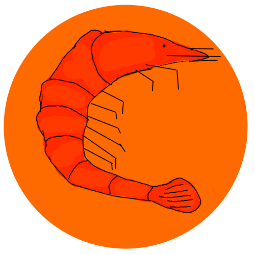

  

### Crustik Chess Engine

#### Plays like a human

##### Summary
- Each piece has its own eval and takes decisions by itself and consults or pieces.
- Uses strategies just like humans.
- Runs on a potato.
- Works on any system easily because it doesnt really need too many libraries.

##### How to Run
- Get GCC on your computer make sure to have it in system path.
- To run for macos and linux use `./run.sh`, in windows double click the .bat file.
- run chess in terminal/cmd with `./crustik` or `crustik` if your on windows.

##### Dev Log
Ideas and stuff I have in future or problems in my etc etc. [DEVLOG](DEVBLOG.md).

##### Problems
`chmod 777 run.sh` if you get permission denied and try again to run it.

##### Notes
if you have the expertise you can use any other C compiler by editing the .sh file.

### Thanks for Help
- Stockfish Discord
- Flow
- Ciekce
- Tobi ∧ The 🨯
- Fangs
- Sp00ph
- Swedish Chef
- Matt
- Aleks Peshkov
- tsoj
- aeth